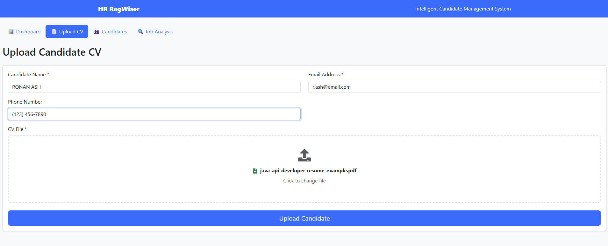
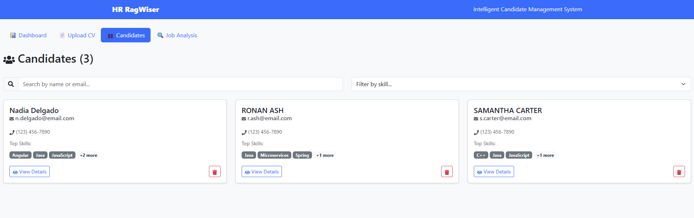
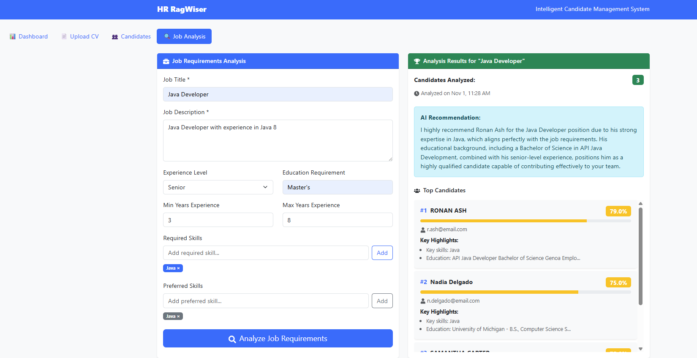
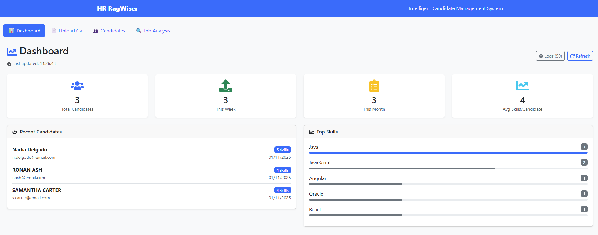

# HR Rag Assistant

An intelligent HR management system that leverages Retrieval-Augmented Generation (RAG) and AI to streamline candidate management, CV analysis, and job matching processes.

## 🎯 Overview

HR Rag Assistant is a full-stack application that combines Spring Boot backend with React frontend to provide comprehensive HR management capabilities. The system uses OpenAI's GPT models and vector embeddings to intelligently analyze candidate CVs, match them with job requirements, and provide AI-powered insights.

## ✨ Key Features

### 📄 Document Processing & RAG
- **CV Upload & Processing**: Upload PDF, DOC, DOCX, and text files
- **Intelligent Text Extraction**: Automatic extraction of candidate information from CVs
- **Vector Storage**: PostgreSQL with pgvector for semantic search capabilities
- **AI-Powered Q&A**: Ask questions about uploaded documents using natural language




### 👥 Candidate Management
- **Complete Candidate Profiles**: Name, email, phone, skills, experience, education
- **Skills Extraction**: Automatic identification of technical and soft skills
- **Experience Analysis**: Years of experience and career history extraction
- **Education Parsing**: Educational background and qualifications



### 🔍 Job Analysis & Matching
- **Smart Job Analysis**: Define job requirements with skills, experience, and education criteria
- **Candidate Ranking**: AI-powered scoring and ranking system (0-100% match)
- **Multi-criteria Evaluation**: 
  - Skills matching (40% weight) - Required vs. Preferred skills
  - Experience level (30% weight) - Years and relevance
  - Education requirements (20% weight)
  - CV content relevance (10% weight)
- **AI Recommendations**: Generated insights for top candidates



### 📊 Dashboard & Analytics
- **Real-time Metrics**: Total candidates, weekly/monthly uploads, skill analytics
- **Visual Insights**: Top skills distribution, candidate statistics
- **Activity Tracking**: Recent uploads and system activities
- **Comprehensive Logging**: System monitoring with exportable logs




## 🏗️ Architecture

### Backend (Spring Boot 3.3.2)
```
src/main/java/ie/com/rag/
├── Application.java           # Main application entry point
├── Constants.java                     # Application constants and prompts
├── config/
│   └── WebConfig.java                 # CORS and web configuration
├── controller/
│   ├── HRController.java             # HR operations (candidates, analysis, metrics)
│   ├── RagController.java            # RAG Q&A functionality
│   └── RagUploaderController.java    # CV upload and processing
├── dto/
│   ├── CandidateDTO.java            # Candidate data transfer objects
│   ├── JobAnalysisRequestDTO.java   # Job analysis request structure
│   ├── JobAnalysisResponseDTO.java  # Job analysis response structure
│   ├── QAHistoryDTO.java            # Q&A history records
│   ├── RankedCandidateDTO.java      # Ranked candidate results
│   └── UploadedDocumentDTO.java     # Document metadata
└── service/
    ├── CandidateService.java        # Candidate CRUD operations
    ├── DashboardService.java        # Dashboard metrics and analytics
    ├── JobAnalysisService.java     # Job matching and ranking logic
    ├── RagDocumentService.java     # Document processing for RAG
    └── RagUploaderService.java     # CV upload and text extraction
```

### Frontend (React 18.2.0)
```
frontend/src/
├── App.js                           # Main application component
├── components/
│   ├── Dashboard.js                 # Analytics dashboard with comprehensive logging
│   ├── DocumentUpload.js            # CV upload interface
│   ├── CandidateList.js            # Candidate management interface
│   ├── JobAnalysisForm.js          # Job analysis and matching
└── App.css                         # Application styling
```

### Database Schema (PostgreSQL with pgvector)
- **candidates**: Complete candidate profiles with skills array
- **job_analyses**: Job requirements and analysis results
- **candidate_rankings**: Scoring and ranking data for each analysis
- **qa_history**: Q&A interaction history
- **uploaded_documents**: Document metadata and tracking
- **vector_store**: Vector embeddings for semantic search

## 🚀 Quick Start

### Prerequisites
- Java 21+
- Node.js 16+
- Docker & Docker Compose
- OpenAI API Key

### 1. Clone and Setup
```bash

git clone https://github.com/RobertoDure/hr-rag-assistant
cd HR-RagWiser
```

### 2. Environment Configuration
Create `.env` file or set environment variable:
```bash

export OPENAI_API_KEY=your_openai_api_key_here
```

### 3. Start Database
```bash 

docker-compose up -d
```
This starts PostgreSQL with pgvector extension on port 5432.

### 4. Backend Setup
```bash

# Build and run Spring Boot application
./mvnw clean spring-boot:run

# Or using Maven wrapper on Windows
mvnw.cmd clean spring-boot:run
```
Backend runs on `http://localhost:8080`

### 5. Frontend Setup
```bash

cd frontend
npm install
npm start
```
Frontend runs on `http://localhost:3000`

## 🔧 Configuration

### Application Properties (`application.yaml`)
```yaml
spring:
  datasource:
    url: jdbc:postgresql://localhost:5432/rag_hr_db
    username: postgres
    password: postgres
  
  ai:
    openai:
      api-key: ${OPENAI_API_KEY}
      chat:
        options:
          model: gpt-4
          temperature: 0.3
          max-tokens: 4000
      embedding:
        options:
          model: text-embedding-3-small
    
    vectorstore:
      table: vector_store
      dimension: 1536
      distance: cosine
```

### Docker Compose Services
- **pgvector**: PostgreSQL 16 with vector extension
- **Database**: `rag_hr_db` with automatic schema initialization

## 📋 API Endpoints

### HR Management
- `GET /api/hr/candidates` - Get all candidates
- `GET /api/hr/candidates/{id}` - Get candidate by ID
- `DELETE /api/hr/candidates/{id}` - Delete candidate
- `POST /api/hr/analyze` - Analyze job requirements
- `GET /api/hr/metrics` - Dashboard metrics
- `GET /api/hr/health` - Health check

### Document Upload & RAG
- `POST /api/rag/upload` - Upload CV with metadata
- `GET /api/rag` - Ask questions about documents
- `GET /api/rag/qa-history` - Get Q&A history
- `GET /api/rag/uploaded-documents` - Get document list

## 🎨 User Interface

### Dashboard Features
- **Real-time Statistics**: Candidate counts, recent activity
- **Visual Analytics**: Skills distribution, experience levels
- **System Monitoring**: Comprehensive logging with export functionality
- **Auto-refresh**: Updates every 5 minutes

### CV Upload Process
1. **File Selection**: Drag-and-drop or file picker
2. **Metadata Entry**: Candidate name, email, phone
3. **Processing**: Text extraction and AI analysis
4. **Storage**: Database persistence and vector indexing

### Job Analysis Workflow
1. **Job Definition**: Title, description, requirements
2. **Candidate Matching**: AI-powered scoring algorithm
3. **Results Display**: Ranked candidates with match percentages
4. **AI Recommendations**: Generated insights for top matches

## 🔍 Matching Algorithm

The system uses a sophisticated 4-factor scoring system:

### Skills Matching (40% weight)
- **Required Skills (70%)**: Must-have competencies
- **Preferred Skills (30%)**: Nice-to-have abilities
- Case-insensitive matching with exact keyword detection

### Experience Level (30% weight)
- **Years Validation**: Minimum/maximum experience requirements
- **Penalty System**: Graduated scoring for over/under-qualification
- **Missing Data Handling**: Neutral scoring for incomplete information

### Education Requirements (20% weight)
- **Level Matching**: Degree type and field alignment
- **Hierarchy Recognition**: Higher degrees satisfy lower requirements
- **Partial Credit**: Scoring for related educational backgrounds

### Content Relevance (10% weight)
- **Keyword Analysis**: Job description terminology in CV
- **Semantic Matching**: Context-aware content evaluation
- **Frequency Weighting**: Multiple mention scoring

## 🛠️ Technology Stack

### Backend Technologies
- **Spring Boot 3.3.2**: Application framework
- **Spring AI 1.0.0-M1**: AI integration and RAG capabilities
- **PostgreSQL**: Primary database with JSON support
- **pgvector**: Vector similarity search
- **Spring Data JDBC**: Database access layer
- **OpenAI Integration**: GPT-4 and embedding models

### Frontend Technologies
- **React 18.2.0**: UI framework
- **React Bootstrap**: Component library
- **Axios**: HTTP client
- **React Router**: Navigation
- **React Dropzone**: File upload
- **React Icons**: Icon library

### Development Tools
- **Maven**: Build management
- **Docker Compose**: Development environment
- **Lombok**: Boilerplate reduction
- **SLF4J**: Logging framework

## 📊 Monitoring & Logging

### Dashboard Logging System
- **Comprehensive Tracking**: All user actions and system events
- **Log Levels**: Info, Warning, Error, Debug
- **Persistent Storage**: LocalStorage with 50-entry limit
- **Export Functionality**: JSON format download
- **Performance Metrics**: API response times and duration tracking

### System Health
- **Auto-refresh**: 5-minute intervals
- **Error Handling**: Graceful degradation and user feedback
- **Health Endpoints**: Service status monitoring

## 🔐 Security Considerations

- **CORS Configuration**: Controlled cross-origin access
- **Input Validation**: Comprehensive request validation
- **File Upload Security**: Type and size restrictions (50MB limit)
- **SQL Injection Prevention**: Parameterized queries
- **Text Sanitization**: Null byte and control character removal

## 📈 Performance Optimizations

- **Database Indexing**: Optimized queries for frequent operations
- **Concurrent Processing**: Parallel API calls in frontend
- **Vector Search**: Efficient similarity matching with pgvector
- **Batch Operations**: Optimized bulk data processing
- **Connection Pooling**: Database connection management

## 🚀 Deployment

### Production Considerations
- Set production OpenAI API key
- Configure database connection pooling
- Enable SSL/TLS for secure connections
- Set up application monitoring
- Configure log aggregation
- Implement backup strategies

### Environment Variables
```bash

OPENAI_API_KEY=your_production_api_key
SPRING_PROFILES_ACTIVE=production
DATABASE_URL=your_production_database_url
```

## 🚢 CI/CD

The HR Rag Assistant includes a complete CI/CD pipeline using Jenkins and Kubernetes for automated building, testing, and deployment.

### 📋 Pipeline Overview

The Jenkins pipeline automates the entire deployment process:

1. **Code Checkout** → Pull latest code from Git repository
2. **Backend Build** → Maven clean install
3. **Testing** → Run unit tests
4. **Docker Build** → Create backend and frontend images (parallel)
5. **Docker Push** → Push images to Docker Hub registry
6. **Kubernetes Deploy** → Deploy to Kubernetes cluster
7. **Verification** → Verify deployment health and status

### 🔧 Jenkinsfile Configuration

The `Jenkinsfile` defines a declarative pipeline with the following stages:

#### Environment Variables
```groovy
GIT_REPO                 # Your GitHub repository URL
GIT_BRANCH              # Branch to build (default: main)
DOCKER_USERNAME         # Docker Hub username
BACKEND_IMAGE           # Backend Docker image name
FRONTEND_IMAGE          # Frontend Docker image name
IMAGE_TAG               # Build number for versioning
K8S_NAMESPACE           # Kubernetes namespace (hr-ragwiser)
```

#### Key Stages

**1. Checkout Stage**
- Pulls code from Git repository
- Supports branch configuration
- Works with GitHub webhooks or polling

**2. Build Backend Stage**
- Runs `mvn clean install -DskipTests`
- Compiles Java code and creates JAR
- Cross-platform support (Unix/Windows)

**3. Test Backend Stage**
- Executes `mvn test`
- Runs all unit tests
- Pipeline fails if tests don't pass

**4. Build Docker Images Stage (Parallel)**
- Builds backend image from root Dockerfile
- Builds frontend image from frontend/Dockerfile
- Tags images with build number
- Parallel execution for efficiency

**5. Push Docker Images Stage**
- Authenticates to Docker Hub using credentials
- Pushes both backend and frontend images
- Images versioned with build number

**6. Deploy to Kubernetes Stage**
- Creates namespace if not exists
- Applies all Kubernetes configurations in order
- Waits for PostgreSQL readiness
- Updates or creates deployments
- Applies ingress rules

**7. Verify Deployment Stage**
- Checks rollout status for all deployments
- Displays pods, services, and deployment status
- Ensures all components are healthy

### ☸️ Kubernetes Configuration Files

The `k8s/` directory contains all Kubernetes manifests for deploying the application:

#### 1. **namespace.yaml** - Namespace Definition
```yaml
Purpose: Isolates application resources
Name: hr-ragwiser
Labels: app=hr-rag-assistant
```
Creates a dedicated namespace for the application, providing resource isolation and organization.

#### 2. **configmap.yaml** - Configuration Data
```yaml
Purpose: Non-sensitive configuration data
Contains:
  - Database connection details (host, port, database name)
  - Spring datasource configuration
  - Backend URL for frontend
  - Application profiles
```
**Key configurations:**
- `POSTGRES_HOST: postgres-service` - Internal K8s service name
- `SPRING_DATASOURCE_URL` - JDBC connection string
- `REACT_APP_BACKEND_URL` - API endpoint for frontend

#### 3. **secret.yaml** - Sensitive Data
```yaml
Purpose: Store passwords and sensitive information
Type: Opaque (base64 encoded)
Contains:
  - POSTGRES_PASSWORD
  - SPRING_DATASOURCE_PASSWORD
```
**⚠️ Important:** Update passwords with base64 encoded values:
```bash
echo -n 'your-actual-password' | base64
```

#### 4. **postgres-pvc.yaml** - Persistent Storage
```yaml
Purpose: Persistent storage for PostgreSQL database
Access Mode: ReadWriteOnce
Storage: 5Gi
```
Ensures database data persists across pod restarts and rescheduling.

#### 5. **postgres-deployment.yaml** - Database Deployment
```yaml
Purpose: PostgreSQL database with pgvector extension
Image: pgvector/pgvector:pg16
Replicas: 1
Resources:
  Requests: 256Mi memory, 250m CPU
  Limits: 512Mi memory, 500m CPU
```
**Features:**
- Uses pgvector-enabled PostgreSQL
- Mounts persistent volume to `/var/lib/postgresql/data`
- Includes liveness and readiness probes
- Environment variables from ConfigMap and Secret

#### 6. **postgres-service.yaml** - Database Service
```yaml
Purpose: Internal service for database access
Type: ClusterIP (internal only)
Port: 5432
Selector: app=postgres
```
Makes PostgreSQL accessible to backend pods within the cluster.

#### 7. **backend-deployment.yaml** - Backend Application
```yaml
Purpose: Spring Boot application deployment
Image: your_dockerhub_user/hr-ragwiser-backend:latest
Replicas: 2 (high availability)
Strategy: RollingUpdate (zero-downtime deployments)
Resources:
  Requests: 512Mi memory, 500m CPU
  Limits: 1Gi memory, 1000m CPU
```
**Features:**
- **Init Container**: Waits for PostgreSQL readiness before starting
- **Health Checks**: Liveness and readiness probes on `/api/hr/health`
- **Environment Variables**: Database credentials and Spring configuration
- **Rolling Updates**: `maxSurge: 1, maxUnavailable: 0` for zero downtime

#### 8. **backend-service.yaml** - Backend Service
```yaml
Purpose: Expose backend API
Type: NodePort
Port: 8080
NodePort: 30080 (external access)
Selector: app=backend
```
Accessible at `http://<node-ip>:30080` for external testing.

#### 9. **frontend-deployment.yaml** - Frontend Application
```yaml
Purpose: React application deployment
Image: your_dockerhub_user/hr-ragwiser-frontend:latest
Replicas: 2 (high availability)
Strategy: RollingUpdate
Resources:
  Requests: 256Mi memory, 250m CPU
  Limits: 512Mi memory, 500m CPU
```
**Features:**
- **Environment Variables**: Backend API URL from ConfigMap
- **Health Checks**: HTTP probes on root path `/`
- **Rolling Updates**: Ensures continuous availability

#### 10. **frontend-service.yaml** - Frontend Service
```yaml
Purpose: Expose frontend application
Type: NodePort
Port: 3000
NodePort: 30000 (external access)
Selector: app=frontend
```
Accessible at `http://<node-ip>:30000` for user access.

#### 11. **ingress.yaml** - Ingress Controller
```yaml
Purpose: HTTP routing and load balancing
IngressClass: nginx
Host: hr-ragwiser.local
Routes:
  - / → frontend-service:3000
  - /api → backend-service:8080
```
**Features:**
- Single entry point for application
- Path-based routing
- SSL redirect disabled for local development

### 🛠️ Prerequisites for CI/CD

#### 1. Jenkins Setup
```bash
# Install Jenkins with Docker support
docker run -d \
  --name jenkins \
  -p 8080:8080 -p 50000:50000 \
  -v jenkins_home:/var/jenkins_home \
  -v /var/run/docker.sock:/var/run/docker.sock \
  jenkins/jenkins:lts
```

**Required Jenkins Plugins:**
- Docker Pipeline
- Kubernetes CLI
- Git Plugin
- Pipeline
- Credentials Binding

#### 2. Jenkins Credentials
Add the following credentials in Jenkins:

**Docker Hub Credentials:**
- ID: `docker`
- Type: Username with password
- Username: Your Docker Hub username
- Password: Your Docker Hub password/token

**Kubernetes Config (if using remote cluster):**
- ID: `kubeconfig`
- Type: Secret file
- File: Your kubeconfig file

#### 3. Kubernetes Cluster
Options for running Kubernetes:

**Local Development:**
- Minikube: `minikube start --cpus=4 --memory=8192`
- Docker Desktop: Enable Kubernetes in settings
- Kind: `kind create cluster --name hr-ragwiser`

**Cloud Providers:**
- Google GKE: `gcloud container clusters create hr-ragwiser`
- AWS EKS: Use eksctl or AWS console
- Azure AKS: Use Azure CLI or portal

#### 4. Ingress Controller (Optional)
```bash
# Install NGINX Ingress Controller
kubectl apply -f https://raw.githubusercontent.com/kubernetes/ingress-nginx/main/deploy/static/provider/cloud/deploy.yaml

# For Minikube
minikube addons enable ingress
```

### 🚀 Running the CI/CD Pipeline

#### Step 1: Update Configuration Files

**Update Jenkinsfile:**
```groovy
// Line 6-7: Update with your repository
GIT_REPO = 'https://github.com/YourUsername/hr-rag-assistant.git'

// Line 11-13: Update with your Docker Hub username
DOCKER_USERNAME = 'your-dockerhub-username'
BACKEND_IMAGE = "your-dockerhub-username/hr-ragwiser-backend"
FRONTEND_IMAGE = "your-dockerhub-username/hr-ragwiser-frontend"
```

**Update Kubernetes Deployments:**
```yaml
# backend-deployment.yaml and frontend-deployment.yaml
# Replace image URLs with your Docker Hub username
image: your-dockerhub-username/hr-ragwiser-backend:latest
image: your-dockerhub-username/hr-ragwiser-frontend:latest
```

**Update Secrets:**
```bash
# Generate base64 encoded password
echo -n 'YourSecurePassword123!' | base64

# Update k8s/secret.yaml with the output
```

#### Step 2: Create Jenkins Pipeline

1. Open Jenkins UI (`http://localhost:8080`)
2. Create New Item → Pipeline
3. Name: `HR-RagWiser-Pipeline`
4. Pipeline → Definition: Pipeline script from SCM
5. SCM: Git
6. Repository URL: Your repository URL
7. Branch: `*/main`
8. Script Path: `Jenkinsfile`
9. Save

#### Step 3: Configure Build Triggers

**Option A: Polling (Simple)**
```groovy
triggers {
    pollSCM('H/5 * * * *')  // Poll every 5 minutes
}
```

**Option B: Webhook (Recommended)**
1. GitHub Settings → Webhooks → Add webhook
2. Payload URL: `http://your-jenkins-url/github-webhook/`
3. Content type: `application/json`
4. Events: Push events
5. Update Jenkinsfile:
```groovy
triggers {
    githubPush()
}
```

#### Step 4: Set Up Kubernetes Access

**For Local Kubernetes:**
```bash
# Copy kubeconfig to Jenkins
docker cp ~/.kube/config jenkins:/var/jenkins_home/kube/config
docker exec jenkins chmod 644 /var/jenkins_home/kube/config
```

**For Remote Kubernetes:**
- Add kubeconfig as Jenkins credential
- Update Jenkinsfile with credential ID

#### Step 5: Run the Pipeline

**Manual Trigger:**
1. Open pipeline in Jenkins
2. Click "Build Now"
3. Monitor console output

**Automatic Trigger:**
- Push code to repository
- Jenkins automatically detects and builds

### 📊 Pipeline Execution Flow

```
┌─────────────────────────────────────────────────────────────┐
│ 1. Checkout Code from Git                                   │
└────────────────┬────────────────────────────────────────────┘
                 ▼
┌─────────────────────────────────────────────────────────────┐
│ 2. Build Backend (Maven)                                    │
│    mvn clean install -DskipTests                            │
└────────────────┬────────────────────────────────────────────┘
                 ▼
┌─────────────────────────────────────────────────────────────┐
│ 3. Test Backend (Maven)                                     │
│    mvn test                                                 │
└────────────────┬────────────────────────────────────────────┘
                 ▼
┌──────────────────────────────┬──────────────────────────────┐
│ 4a. Build Backend Image      │ 4b. Build Frontend Image     │
│     (Parallel)               │     (Parallel)               │
└──────────────┬───────────────┴──────────────┬───────────────┘
               └────────────┬──────────────────┘
                            ▼
┌─────────────────────────────────────────────────────────────┐
│ 5. Push Images to Docker Hub                                │
│    - backend:BUILD_NUMBER                                   │
│    - frontend:BUILD_NUMBER                                  │
└────────────────┬────────────────────────────────────────────┘
                 ▼
┌─────────────────────────────────────────────────────────────┐
│ 6. Deploy to Kubernetes                                     │
│    ├── Create namespace                                     │
│    ├── Apply ConfigMap & Secret                             │
│    ├── Deploy PostgreSQL (PVC + Deployment + Service)       │
│    ├── Wait for PostgreSQL ready                            │
│    ├── Deploy Backend (Deployment + Service)                │
│    ├── Deploy Frontend (Deployment + Service)               │
│    └── Apply Ingress                                        │
└────────────────┬────────────────────────────────────────────┘
                 ▼
┌─────────────────────────────────────────────────────────────┐
│ 7. Verify Deployment                                        │
│    ├── Check rollout status                                 │
│    ├── Display pods status                                  │
│    └── Display services status                              │
└─────────────────────────────────────────────────────────────┘
```

### 🔍 Monitoring and Troubleshooting

#### View Deployment Status
```bash
# Check all resources in namespace
kubectl get all -n hr-ragwiser

# Check pod logs
kubectl logs -f deployment/backend -n hr-ragwiser
kubectl logs -f deployment/frontend -n hr-ragwiser
kubectl logs -f deployment/postgres -n hr-ragwiser

# Describe pod for detailed information
kubectl describe pod <pod-name> -n hr-ragwiser

# Check events
kubectl get events -n hr-ragwiser --sort-by='.lastTimestamp'
```

#### Common Issues and Solutions

**1. Image Pull Errors**
```bash
# Check image name in deployment
kubectl get deployment backend -n hr-ragwiser -o yaml | grep image

# Verify Docker Hub credentials
docker login

# Update deployment with correct image
kubectl set image deployment/backend backend=your-username/hr-ragwiser-backend:TAG -n hr-ragwiser
```

**2. Database Connection Issues**
```bash
# Check PostgreSQL is running
kubectl get pods -n hr-ragwiser -l app=postgres

# Test database connection
kubectl exec -it deployment/postgres -n hr-ragwiser -- psql -U postgres -d rag_hr_db

# Check service DNS
kubectl exec -it deployment/backend -n hr-ragwiser -- nslookup postgres-service
```

**3. Backend Not Starting**
```bash
# Check init container status
kubectl describe pod <backend-pod> -n hr-ragwiser

# Check environment variables
kubectl exec -it deployment/backend -n hr-ragwiser -- env | grep SPRING

# View backend logs
kubectl logs -f deployment/backend -n hr-ragwiser
```

**4. Frontend Can't Connect to Backend**
```bash
# Check backend service
kubectl get svc backend-service -n hr-ragwiser

# Test backend health endpoint
kubectl run curl-test --image=curlimages/curl -it --rm -- curl http://backend-service:8080/api/hr/health

# Check ConfigMap
kubectl get configmap hr-ragwiser-config -n hr-ragwiser -o yaml
```

#### Jenkins Pipeline Debugging

**View Build Logs:**
- Click on build number → Console Output

**Common Jenkins Issues:**

**Docker Permission Denied:**
```bash
# Add Jenkins user to docker group
docker exec -u root jenkins usermod -aG docker jenkins
docker restart jenkins
```

**Kubectl Not Found:**
```bash
# Install kubectl in Jenkins container
docker exec -u root jenkins curl -LO "https://dl.k8s.io/release/$(curl -L -s https://dl.k8s.io/release/stable.txt)/bin/linux/amd64/kubectl"
docker exec -u root jenkins install -o root -g root -m 0755 kubectl /usr/local/bin/kubectl
```

**Maven Build Fails:**
```bash
# Check Java version in Jenkins
docker exec jenkins java -version

# Ensure Maven is installed
docker exec jenkins mvn -version
```

### 🔐 Security Best Practices

1. **Secrets Management:**
   - Never commit secrets to Git
   - Use Kubernetes Secrets for sensitive data
   - Consider using HashiCorp Vault or AWS Secrets Manager
   - Rotate credentials regularly

2. **Image Security:**
   - Scan Docker images for vulnerabilities
   - Use specific image tags, avoid `latest`
   - Implement image signing
   - Use private registries for production

3. **RBAC (Role-Based Access Control):**
   - Create service accounts for applications
   - Limit namespace permissions
   - Use network policies to restrict traffic

4. **Network Security:**
   - Enable TLS for ingress
   - Use network policies to isolate pods
   - Restrict nodePort access in production

### 🎯 Production Deployment Tips

1. **Resource Limits:**
   - Always define CPU and memory limits
   - Monitor resource usage and adjust
   - Use Horizontal Pod Autoscaler (HPA) for scaling

2. **High Availability:**
   - Run multiple replicas (≥2)
   - Use pod anti-affinity for distribution
   - Implement readiness and liveness probes

3. **Backup Strategy:**
   - Regular database backups
   - Use VolumeSnapshots for PVC backups
   - Store backups in remote location

4. **Monitoring:**
   - Set up Prometheus and Grafana
   - Monitor application metrics
   - Set up alerts for critical issues

5. **Rolling Updates:**
   - Use proper update strategies
   - Test in staging environment first
   - Implement blue-green or canary deployments

### 📈 Scaling the Application

**Horizontal Pod Autoscaling:**
```bash
# Create HPA for backend
kubectl autoscale deployment backend \
  --cpu-percent=70 \
  --min=2 \
  --max=10 \
  -n hr-ragwiser

# Create HPA for frontend
kubectl autoscale deployment frontend \
  --cpu-percent=70 \
  --min=2 \
  --max=5 \
  -n hr-ragwiser
```

**Manual Scaling:**
```bash
# Scale backend
kubectl scale deployment backend --replicas=5 -n hr-ragwiser

# Scale frontend
kubectl scale deployment frontend --replicas=3 -n hr-ragwiser
```

### 🧹 Cleanup and Rollback

**Delete Deployment:**
```bash
# Delete entire namespace (removes everything)
kubectl delete namespace hr-ragwiser

# Delete specific resources
kubectl delete -f k8s/ -n hr-ragwiser
```

**Rollback Deployment:**
```bash
# View rollout history
kubectl rollout history deployment/backend -n hr-ragwiser

# Rollback to previous version
kubectl rollout undo deployment/backend -n hr-ragwiser

# Rollback to specific revision
kubectl rollout undo deployment/backend --to-revision=2 -n hr-ragwiser
```

### 📚 Additional Resources

- **Kubernetes Documentation:** https://kubernetes.io/docs/
- **Jenkins Pipeline Syntax:** https://www.jenkins.io/doc/book/pipeline/syntax/
- **Docker Best Practices:** https://docs.docker.com/develop/dev-best-practices/
- **Ingress NGINX:** https://kubernetes.github.io/ingress-nginx/

---

## 🤝 Contributing

1. Fork the repository
2. Create feature branch (`git checkout -b feature/amazing-feature`)
3. Commit changes (`git commit -m 'Add amazing feature'`)
4. Push to branch (`git push origin feature/amazing-feature`)
5. Open Pull Request

## 📝 License

This project is licensed under the MIT License - see the LICENSE file for details.

## 🆘 Support

For support and questions:
- Create an issue in the repository
- Check the application logs via the dashboard
- Review the comprehensive logging system for debugging

---

**HR Rag Assistant** - Transforming HR management with AI-powered intelligence.
